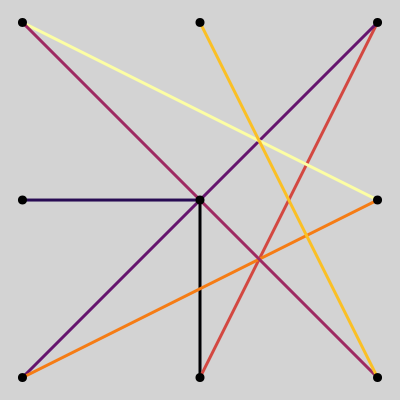
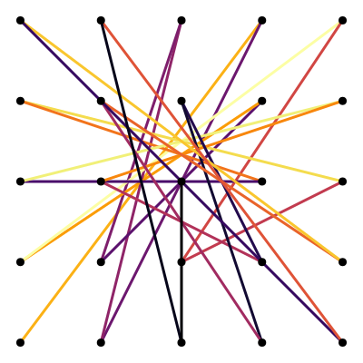
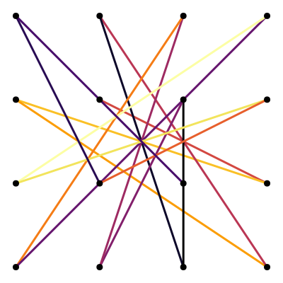
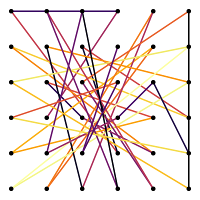

# Solving the Most Complex Lock Patterns
3×3 | 5×5
:-:|:-:
 | 
distance: 22 | distance: 116

4×4 | 6×6
:-:|:-:
 | 
distance: 60 | distance: 188

[](https://jaantollander.github.io/LockPatternComplexity.jl/stable)
[](https://jaantollander.github.io/LockPatternComplexity.jl/dev)
[](https://github.com/jaantollander/LockPatternComplexity.jl/actions)

Solving the most complex lock patterns using Constraint Programming with [MiniZinc](https://www.minizinc.org/).

Lock patterns plots are generated using [Julia Language](https://julialang.org/) with Plots.jl package.

This problem was inspired by [What Is The Most Complicated Lock Pattern?](https://www.youtube.com/watch?v=PKjbBQ0PBCQ) by *Dr. Zye*. I highly recommend watching the video!

You can try out lock patterns with [lock pattern demo](https://tympanix.github.io/pattern-lock-js/) by @tympanix.


## About
We use similar definition of lock pattern complexity as in the *Dr. Zye*'s video. However, we generalize the definition such that we can find solutions for all n×n grid sizes.

**Satisfiability problem** cares about finding a max complexity patterns, that is, patterns where each line has a unique line type.

**Optimization problem** consideres max complexity pattern with higher taxicab distance as more complex.

For small instances, it is possible to find the maximum the taxicab distance. For larger instances, simply finding satisfying solutions can be quite difficult.

I'm writing more in-depth theory to the [**documentation**](https://jaantollander.github.io/LockPatternComplexity.jl/dev/).


## Open Questions
Can we find a max complexity pattern for 4×4 grid that provably maximizes the taxicab distance?

Can we find a max complexity pattern for 5×5 grid that provably maximizes the taxicab distance?

Can we find a max complexity pattern for 7×7 grid?

<!-- We can generalize the definition of pattern complexity as maximizing the number of line types used in the pattern as primary objective and maximizing the taxicab distance as secondary objective. In the generalized definition, every grid size would have solutions. Also, it would preserve the max complexity patterns. -->

<!-- A question that arises from the generalized definition is whether all grids have a generalized complexity pattern such that each line has a unique type. -->


## Structure
The [`src/nxn.mzn`](./src/nxn.mzn) file contains the MiniZinc constraint programming formulation.

The [`src/plots.jl`](./src/plots.jl) file contains the plotting code.

Use [`scripts/run.jl`](./scripts/run.jl) Julia script for running the model for the grid of given size.

Use [`scripts/plot.jl`](./scripts/plot.jl) Julia script to plot results.

The [`results`](./results/) directory contains the output from the shell scripts and the generated SVG plots for each grid size and taxicab distance in format `<grid>/<distance>/<id>.svg`.


## Instructions
We can begin by installing MiniZinc and adding it to our PATH environment variable. The, we can run Julia file from the `scripts` directory and write the output to `results/3x3.txt` file. For example:

```bash
julia scripts/run.jl -n 3 --minizinc `which minizinc` > results/3x3.txt
```
