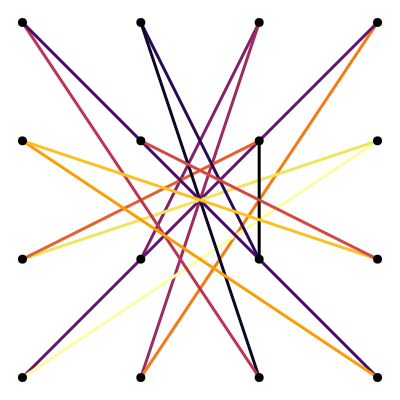
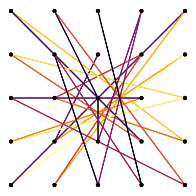
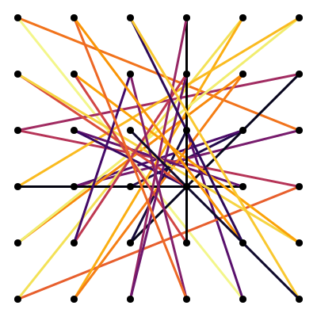
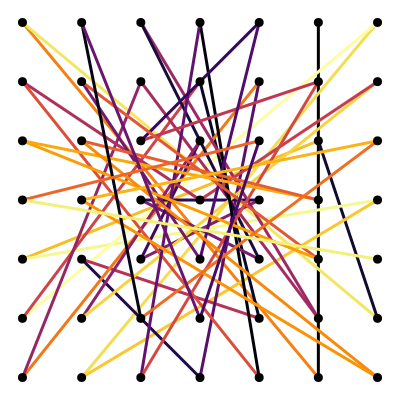
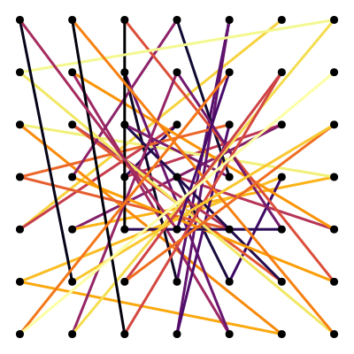

# Solving the Most Complex Lock Patterns
3×3 | 4×4
:-:|:-:
 | 
distance: 22* | distance: 61*

5×5 | 6×6
:-:|:-:
 | 
distance: 117 | distance: 207

7×7 | 7×7
:-: | :-:
 | 
distance=307 | distance=306

[](https://jaantollander.github.io/LockPatternComplexity.jl/stable)
[](https://jaantollander.github.io/LockPatternComplexity.jl/dev)
[](https://github.com/jaantollander/LockPatternComplexity.jl/actions)
[](https://zenodo.org/badge/latestdoi/433790288)

Solutions for the most complex lock patterns using Constraint Programming with [MiniZinc](https://www.minizinc.org/). As solvers, we use Chuffed for satisfiability and [Google OR-Tools](https://developers.google.com/optimization/) for optimization.

Lock patterns plots are generated using [Julia Language](https://julialang.org/) with Plots.jl package.

This problem was inspired by [What Is The Most Complicated Lock Pattern?](https://www.youtube.com/watch?v=PKjbBQ0PBCQ) by *Dr. Zye*. I highly recommend watching the video!

You can try out lock patterns with [lock pattern demo](https://tympanix.github.io/pattern-lock-js/) by @tympanix.


## About
We use similar definition of lock pattern complexity as in the *Dr. Zye*'s video. However, we generalize the definition such that we can find solutions for all n×n grid sizes.

**Satisfiability problem** cares about finding a max complexity patterns, that is, patterns where each line has a unique line type.

**Optimization problem** consideres max complexity pattern with higher taxicab distance as more complex.

For small instances, it is possible to find the maximum the taxicab distance. For larger instances, simply finding satisfying solutions can be quite difficult.

I'm writing more in-depth theory to the [**documentation**](https://jaantollander.github.io/LockPatternComplexity.jl/dev/).


## Open Questions
~~Can we find a max complexity pattern for 4×4 grid that provably maximizes the taxicab distance?~~

Can we find a max complexity pattern for 5×5 grid that provably maximizes the taxicab distance?

~~Can we find a max complexity pattern for 7×7 grid?~~


## Structure
The [`models/`](./models/) directory contains the MiniZinc constraint programming formulations.

The [`src/`](./src/) directory contains Julia code for generating data to models and plotting results.

Use [`scripts/`](./scripts/) directory contains scripts for generating data files, running the model and plotting results.

The [`results`](./results/) directory contains the output from the models.

The [`plots`](./plots/) directory contains the generated SVG plots for each grid size and taxicab distance in format `<grid>/<distance>/<id>.svg`.


## Instructions
We can begin by installing MiniZinc and adding it to the PATH environment variable. You can use shell scripts for [installing MiniZinc and Google OR-Tools on Linux](https://github.com/jaantollander/install-minizinc-ortools). Chuffed solver is bundled with MiniZinc.

Then, we can run shell scripts from the `scripts` directory and write the output to `results/3x3.txt` file. For example, for the satisfiability we can run:

```bash
./scripts/nxn_sat.sh 3 > results/3x3.txt
```

For optimization, we can run:

```bash
./scripts/nxn_opt.sh 3 > results/3x3.txt
```
