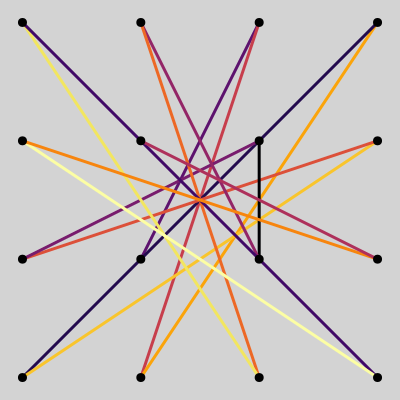
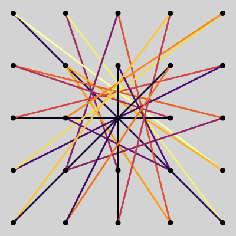
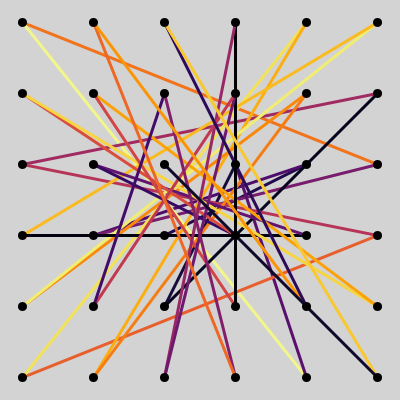
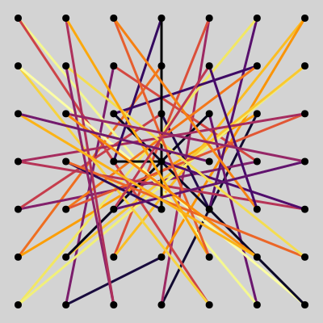
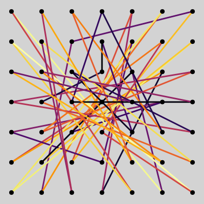

# Solving the Most Complex Lock Patterns
3×3 | 4×4
:-:|:-:
 | 
distance: 22* | distance: 61*

5×5 | 6×6
:-:|:-:
 | 
distance: 119 | distance: 207

7×7 | 7×7
:-: | :-:
 | 
distance=315 | distance=317

<!-- [](https://jaantollander.github.io/LockPatternComplexity.jl/stable) -->
[](https://jaantollander.github.io/LockPatternComplexity.jl/dev)
[](https://github.com/jaantollander/LockPatternComplexity.jl/actions)
[](https://zenodo.org/badge/latestdoi/433790288)

## About
In this repository, we present solutions for the most complex lock patterns using the [MiniZinc](https://www.minizinc.org/) modeling language and the powerful [Google OR-Tools](https://developers.google.com/optimization/) solver. Additionally, we use the [Julia Language](https://julialang.org/) to generate the input data and analyze the results.

This repository was inspired by the video [*What Is The Most Complicated Lock Pattern?*](https://www.youtube.com/watch?v=PKjbBQ0PBCQ) by *Dr. Zye*. I highly recommend watching it! Also, you can try out lock patterns with [lock pattern demo](https://tympanix.github.io/pattern-lock-js/) by @tympanix.

We use a generalized definition of maximum complexity for a lock pattern, presented in *Dr. Zye*'s video, such that it has solutions for all n×n grids while preserving the original solutions. Our definition requires all lines in the pattern to have a unique "type" (slope), and we maximize the total ["taxicab" distance](https://en.wikipedia.org/wiki/Taxicab_geometry) of the pattern, which results in greater visual complexity for the patterns. The problem is a **combinatorial optimization** problem. The  [**documentation**](https://jaantollander.github.io/LockPatternComplexity.jl/dev/) covers the theoretical aspect of the problem.


## Structure
This repository is structured as follows:

* The [`src/`](./src/) directory contains Julia code.
* The [`models/`](./models/) directory contains the MiniZinc models.
* The [`scripts/`](./scripts/) directory contains scripts for generating data files, running the model, and plotting the results.
* The [`results/`](./results/) directory contains the text output from the models.
* The [`plots/`](./plots/) directory contains the generated SVG plots for each grid size and taxicab distance in format `<grid>/<distance>/<id>.svg`. The `<id>` is a unique identified generated using hash of the pattern.


## Instructions
To begin, we need to install MiniZinc and Google OR-Tools. On Linux, we can use the following [shell scripts](https://github.com/jaantollander/install-minizinc-ortools) for the installation.

Then, we can run shell scripts from the `scripts` directory and write the output to the `results/3x3.txt` file. For example, we can run the optimization model using the following command.

```bash
./scripts/nxn_opt.sh 3 results/3x3.txt
```


## Open Questions
~~Can we find a max complexity pattern for a 4×4 grid that provably maximizes the taxicab distance?~~

Can we find a max complexity pattern for a 5×5 grid that provably maximizes the taxicab distance?

~~Can we find a max complexity pattern for a 7×7 grid?~~
