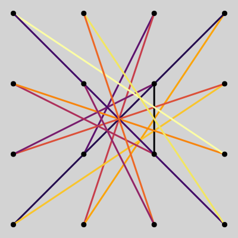
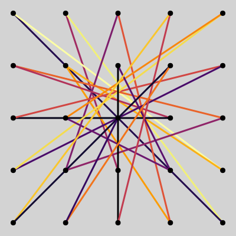
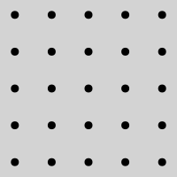
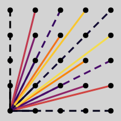
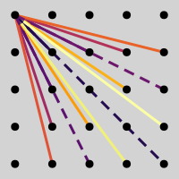
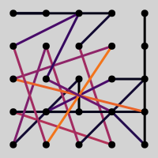
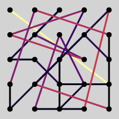

```@meta
CurrentModule = LockPatternComplexity
```

# Solving the Most Complex Lock Patterns
Documentation for [LockPatternComplexity](https://github.com/jaantollander/LockPatternComplexity.jl).


## Definition
4×4 | 5×5
:-:|:-:
 | 
distance=61 | distance=119

We can state the problem of finding a maximum complexity lock pattern as follow. *Over all lock patterns, excluding symmetrical patterns, that satisfy the maximum complexity condition, find the lock pattern that maximizes its taxicab distance.*


## Grids
Grid: 5×5 |
:-:|
 |

We define a **grid** of size $n×n$ where $n∈ℕ$ as set of points

```math
\begin{aligned}
G &= \{1,...,n\}×\{1,...,n\}\\
 &= \{(x, y) ∣ x,y∈\{1,...,n\}\}.
\end{aligned}
```

The set of **indices** of a grid is

```math
I=\{1,2,...,n^2\}.
```

We denote indidual points ``(x_i, y_i)`` where ``i∈I.``

!!! example
    We define a $3×3$ grid as $G=\{(1, 1), (1, 2), (1, 3), (2, 1), ..., (3, 3)\}$ with indices $I=\{1, 2, 3, 4, 5, 6, 7, 8, 9\}.$


## Lines and Line Types
Line types: $y_{i,j}≥0$ | Line types: $y_{i,j}<0$
:-:|:-:
 | 

A **line** connects two points in the grid. We represent lines as a pair of indices $(i,j)$ where $i,j∈I.$ We denote the **difference** between the endpoints of a line as $(x_{i,j}, y_{i,j})$ where $x_{i,j}=x_j-x_i$ and $y_{i,j}=y_j-y_i.$ 

---

We define a **line type** as a tuple $(x,y)$ such that $x≥0$ and $x$ and $y$ are coprime, that is, $\gcd(x,y)=1.$ We can calculate the type for a line as

$$t(i,j)=\begin{cases}
(x_{i,j}/d, y_{i,j}/d), & x_{i,j}≥0 \\
(-x_{i,j}/d, -y_{i,j}/d) & x_{i,j}<0
\end{cases}.$$

where the greatest common divisor between the differences is

$$d=\gcd(x_{i,j},y_{i,j}).$$

That is, we regard all lines with differences of form $(c⋅x_{i,j}/d,c⋅y_{i,j}/d)$ where $c∈ℤ ∖ \{0\}$ as the same type.

---

The set of all possible lines

$$L=\{(i, j) ∣ i,j∈I, i≠j\}$$

All differences

$$Δ=\{(x_{i,j}, y_{i,j})∣ (i,j)∈L\}$$

All **line types**

$$T=\{(x, y) ∣ (x,y)∈Δ, \gcd(x, y)=1, x≥0\}$$

We consider $(x,y)$ and $(-x, -y)$ are same type, therefore, we add the constraint $x≥0.$

---

Lower bound for line types. [How Many Rational Slopes](https://math.stackexchange.com/questions/1325258/how-many-rational-slopes)

$$|T|≥12⋅(n-1)^2/π^2.$$


## Patterns
A **pattern** is a subset of lines

$$L^{′}=\{(i_1,j_1),(i_2,j_2),...,(i_{m-1},j_{m-1})\}⊆L.$$

such that $|L^{′}|=m-1$ where $m=n^2.$


## Lock Patterns
Example of a lock pattern | Another example of a lock pattern
:-:|:-:
 | 

A **lock-pattern** connects all points in the grid with lines such that we visit each point only once. That is, lines $L^{′}$ form a lock pattern if the starting point for the next line is the end point of the previous line

$$(i_2=j_1)∧(i_3=j_2)∧...∧(i_{m-1}=j_{m-2})$$

and all starting points are unique

$$\mathtt{alldifferent}(i_1,i_2,...,i_{m-1}).$$

Therefore, we can represent a lock pattern as a permutation of indices $I$, that is

$$p=(i_1,i_2,...,i_m),\quad i_m=j_{m-1}.$$

---

We can prove that $|T|≥|L^{′}|=n^2-1$

Plot $|T|$, $n^2-1$, and $12⋅(n-1)^2/π^2$.


## Maximum Complexity Condition
The set of lines types for the pattern $L^{′}$ is

$$T^{′}=\{t(i, j) ∣ (i,j)∈L^{′}\}.$$

When there are more line types than lines in the pattern $|T|≥|L^{′}|,$ the pattern is a **max complexity pattern** if each line type is unique.

$$|T^{′}|=|L^{′}|$$

When $|T|=|L^{′}|$ the lines types cover all line types.


## Taxicab Distance
The set of differences for the pattern $L^{′}$ is

$$Δ^{′}=\{(x_{i,j}, y_{i,j})∣ (i,j)∈L^{′}\}.$$

Then, we define the Taxicab distance as

$$d=∑_{(x,y)∈Δ^{′}} (|x|+|y|).$$


## Symmetrical Patterns
Two patterns are symmetrical a permutation from one to the other preserves distances.
